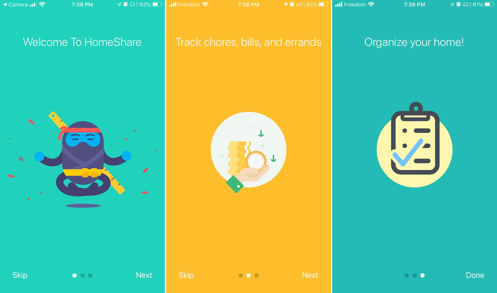
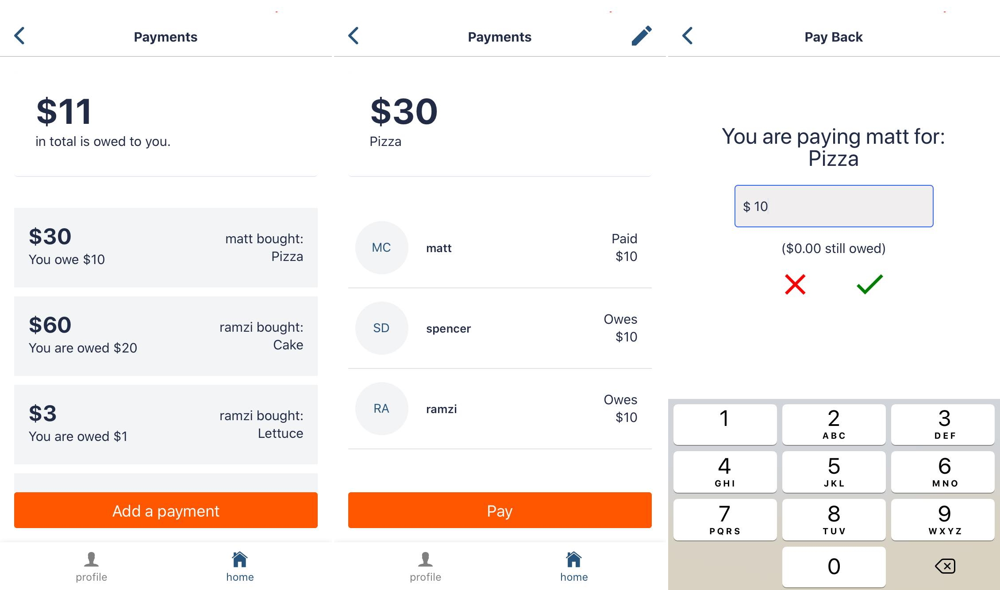
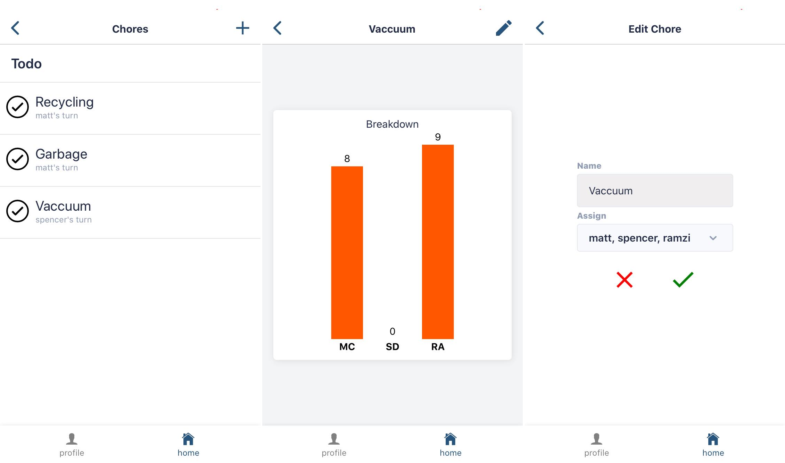
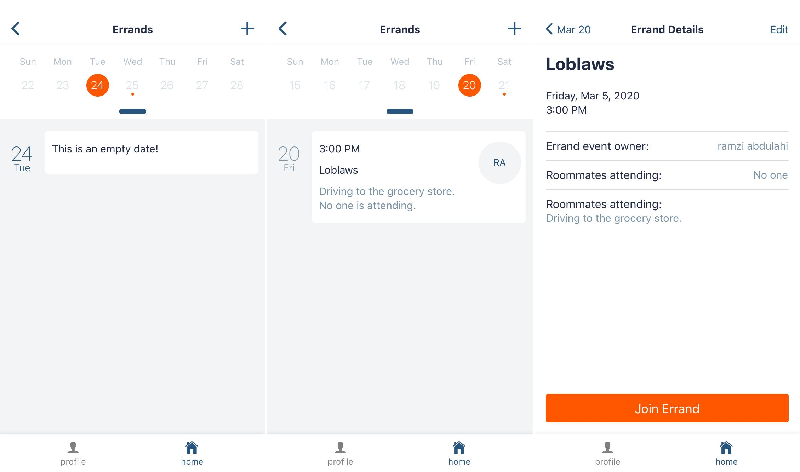
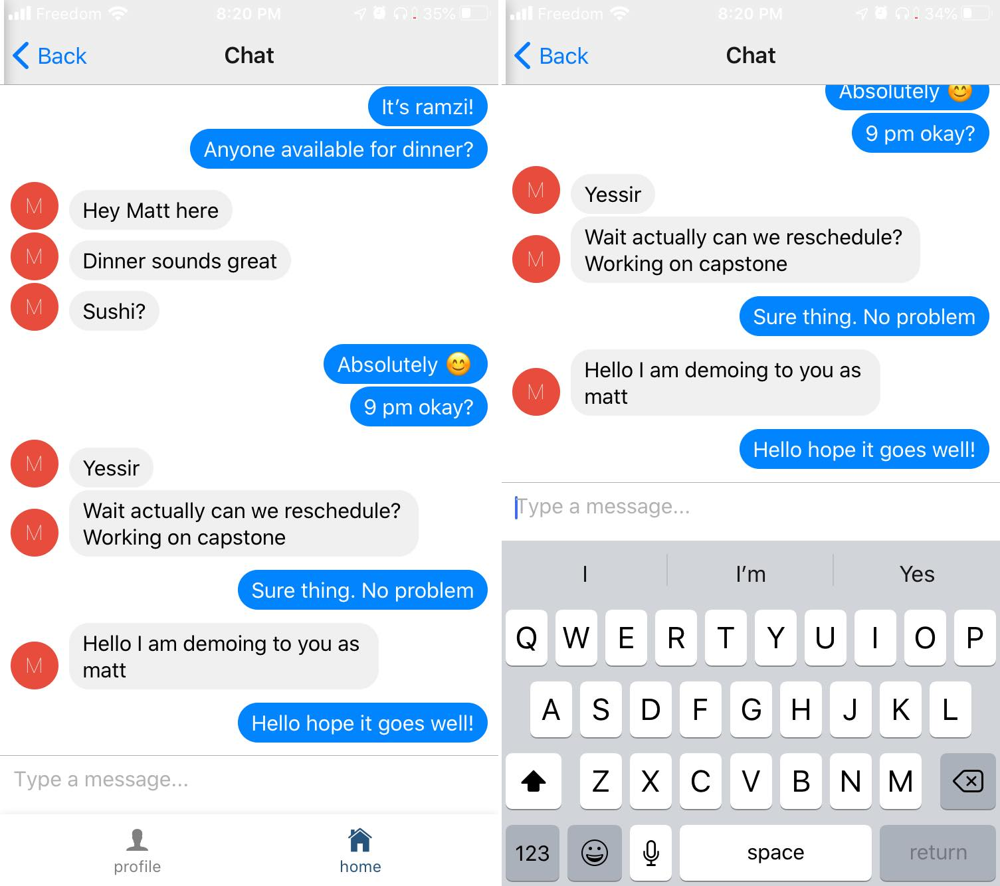
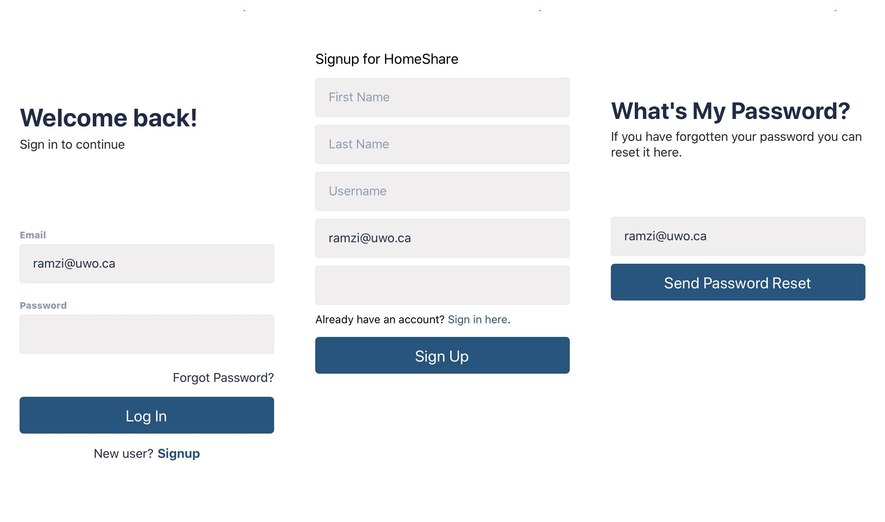
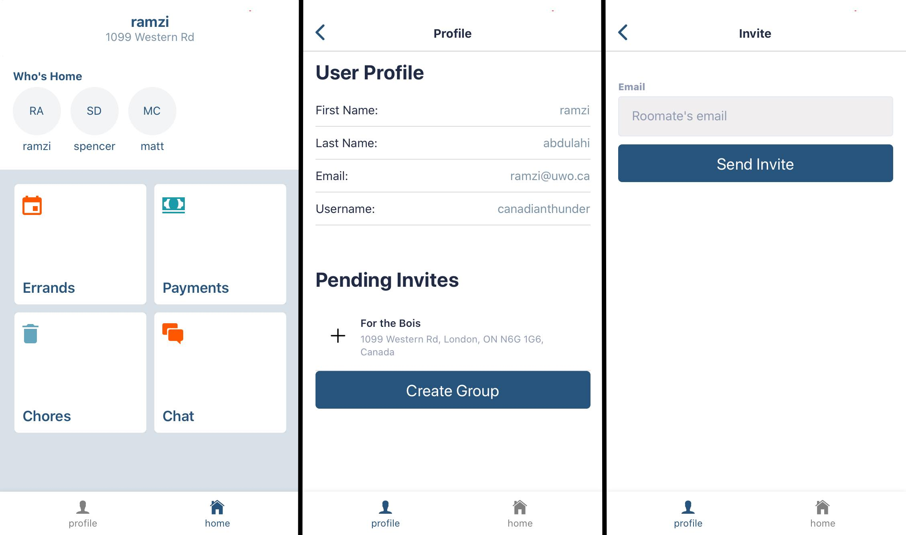

# HomeShare

## Welecome to HomeShare, our Capstone Design Project

### HomeShare was built to make living together as roommates easier. It provides a bunch of different features that help roommates organize, communicate, and make co-sharing a home that much easier.

 

# Core Features

## Shared Utility Payments / IOUs
Utilities and bills are usually split amongst everyone in a home. This feature provides a single source of truth about who still owes how much money towards a certain bill. It's also handy for keeping track of personal debts between roommates.

 

## Chore Organization
Chores aren't fun, but they're not so bad if everyone does their part! This tool keeps track of how many times someone's done a chore and also notifies whoever's up next that it's their turn.

 

## Errand Organization
We all have the experience of having that one college roommate with a car. With enough people, coordinating things like getting groceries can be tricky! That's why HomeShare provides a way for users to log calender dates of when they plan on making trips and errand runs. Everyone in a home can see the log and 'join in' on the errand, notifying the creater of the log that others would like to join.

 

## Instant Group Messaging
Communication is key, and although there's already many ways to chat; how can HomeShare be the number one home co-sharing app out there without instant chat functionality?

 

# Privacy

## Firebase Authentication
Making sure that user information is private and secure is important to us. That's why HomeShare requires users to create an account backed by Firebase Authentication. Messages, bills, and all personal information is kept between you, and your group.

 

## Invite Only
You control who has access to your group. No unexpected visitors allowed. Just use a roommate's email to send and invite to your group so that you can start using HomeShare together!

